<p align="center">
  
</p>

<h1 align="center">Music Together</h1>

<p align="center">
  多人实时同步听歌平台：部署一个服务端，在 Web、Android 与 Windows 桌面端进入同一批房间、队列和播放状态。
</p>

<p align="center">
  <a href="README.en.md">English</a>
</p>

## UI Reference

本项目 Web 端 UI 的整体视觉风格、组件动效及部分交互细节参考了 [Madokamaes/music-together](https://github.com/Madokamaes/music-together)。感谢项目作者的设计与开源工作。

## 项目概览

Music Together 由一个 Node.js 服务端和多个客户端组成。房间、身份、队列、投票、聊天与播放时钟均由服务端协调；客户端负责展示、音频播放和本机系统集成。所有客户端使用同一套 HTTP 与 WebSocket 协议，因此可以跨设备加入同一房间并保持同步。

| 平台 | 实现 | 当前状态 | 适用场景 |
| --- | --- | --- | --- |
| Web | React + Vite | `main` 分支 | 浏览器、移动浏览器与快速部署 |
| Android | Kotlin + Jetpack Compose + Media3 | `codex/android-native-client` 分支，v2.2.5 | 原生后台播放、系统媒体卡片和多服务器大厅 |
| Windows 桌面端 | Electron + React + TypeScript | `codex/windows-native-client` 分支 | 桌面应用、独立窗口与本地安装包 |

> Android 与桌面客户端目前各自独立维护，不包含服务端。先部署或启动 `main` 分支的服务端，再在客户端中填写服务端地址。

## 截图

### Web 桌面端

| 1 | 2 | 3 | 4 | 5 |
| --- | --- | --- | --- | --- |
|  | 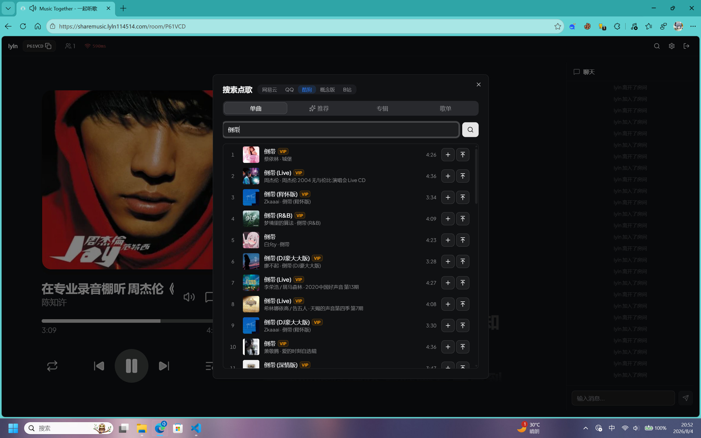 |  |  | 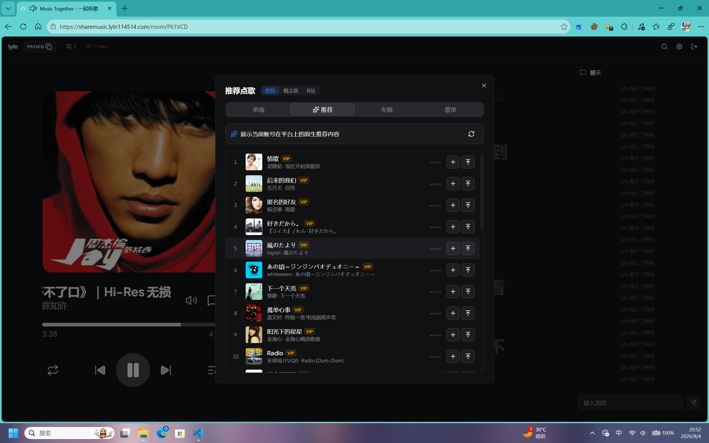 |

### Web 移动端

| 1 | 2 | 3 | 4 | 5 |
| --- | --- | --- | --- | --- |
|  |  |  |  | 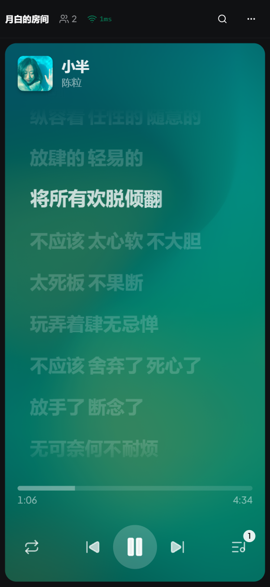 |

### Android 原生客户端

| 启动页 | 1 | 2 | 3 | 4 |
| --- | --- | --- | --- | --- |
| 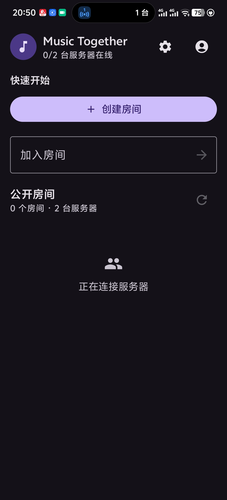 |  | 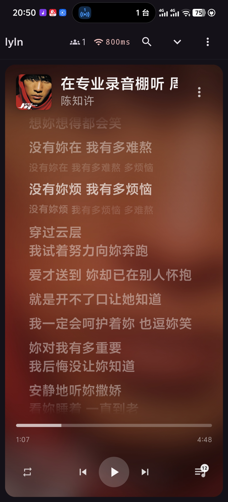 | 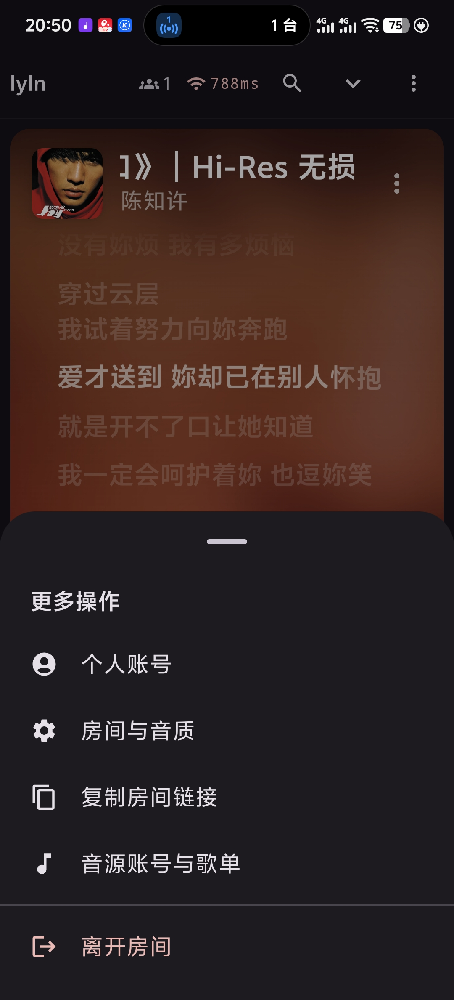 | 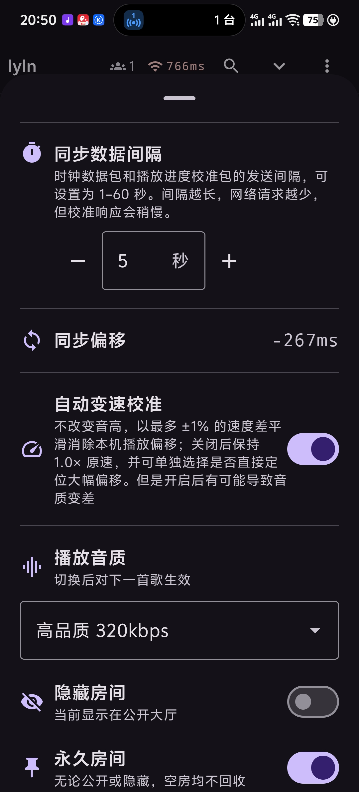 |

### Windows 桌面客户端

| 1 | 2 | 3 | 4 | 5 |
| --- | --- | --- | --- | --- |
| 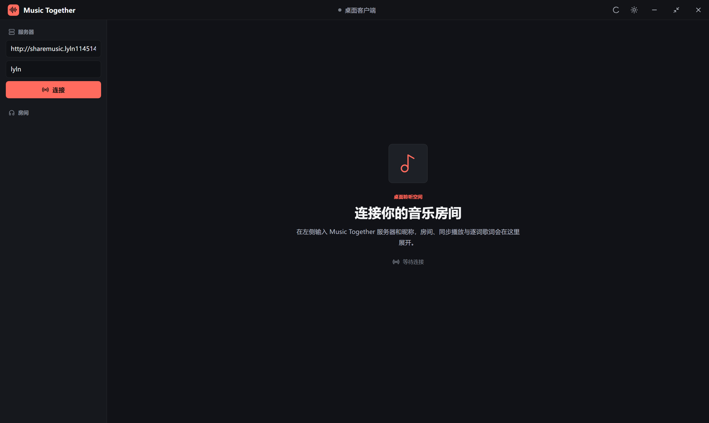 | 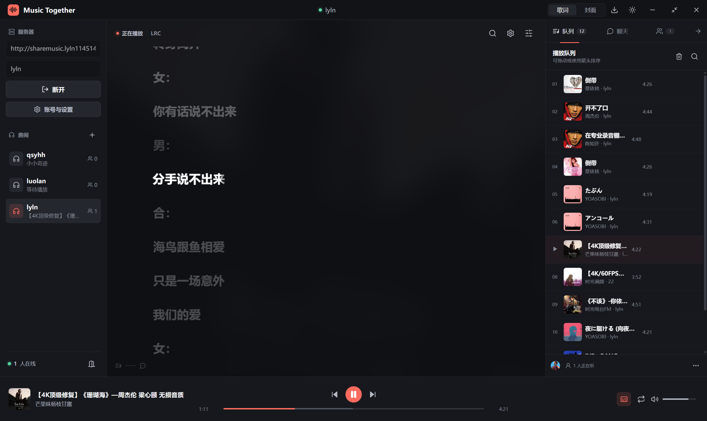 | 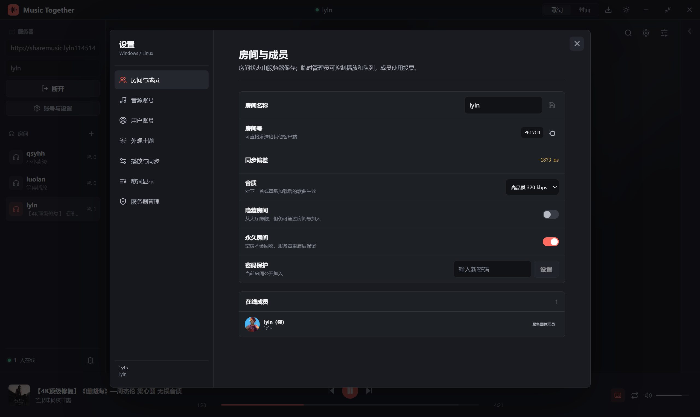 | 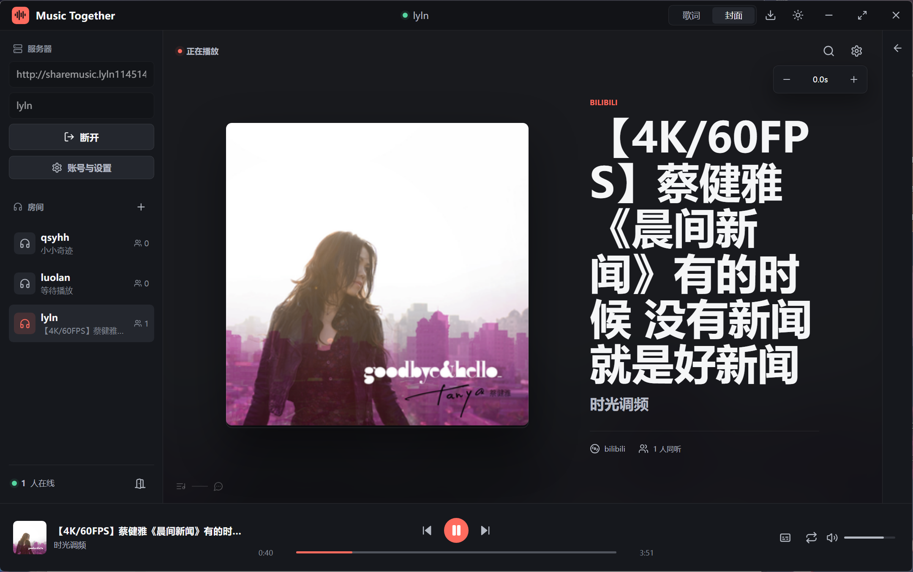 | 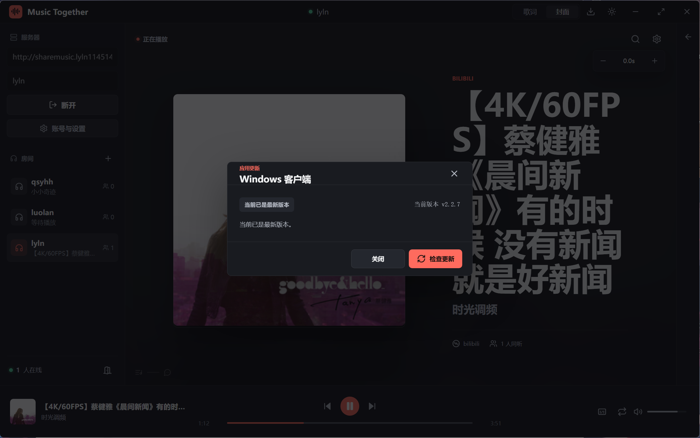 |

## 核心能力

- 实时房间同步：时钟校正、计划执行、进度上报与漂移修正
- 多音乐来源：网易云音乐、QQ 音乐、酷狗音乐、酷狗概念版和 Bilibili
- 平台账号与歌单：扫码或 Cookie 登录、收藏/歌单读取，以及按账号能力选择音质
- 房间协作：创建与密码房间、邀请链接、队列、聊天、成员角色、投票和隐藏房间
- 播放体验：顺序、单曲循环、列表循环和随机播放；逐词、翻译、音译、Ruby 等歌词能力
- 跨端接入：浏览器、Android 原生播放器和 Windows 桌面客户端可以进入同一服务端房间

## 架构

```text
Web 客户端 / Android 客户端 / Windows 桌面客户端
                    │ HTTP + WebSocket
                    ▼
          Music Together Node.js 服务端
                    │
     房间状态、时钟同步、鉴权、音乐与歌词代理
```

服务端保存房间数据和服务端账号配置。音乐平台 Cookie 仅提交给连接的 Music Together 服务端；Bilibili 和需要代理的音频由服务端转发，避免把平台凭据暴露给其他房间成员。

## Web 与服务端开发

### 环境要求

- Node.js 22 或更高版本
- pnpm 10 或更高版本

### 启动

```powershell
git clone https://github.com/LiuYunLingNai/music-together.git
cd music-together
pnpm install --frozen-lockfile
pnpm dev
```

- Web 客户端：`http://localhost:5173`
- 服务端：`http://localhost:3001`

Web 客户端在默认自动模式下会连接当前访问来源对应的服务端。分离部署或需要限制来源时，配置服务端的 `CLIENT_URL`。

### 本地构建运行（不使用 Docker）

需要 Node.js 24 或更高版本。构建完成后，Node.js 服务端会自动托管 Web 静态文件、API 和 WebSocket，只需开放一个端口（默认 `3001`）。

```powershell
git clone https://github.com/LiuYunLingNai/music-together.git
cd music-together
pnpm install --frozen-lockfile
pnpm build
```

在项目根目录创建 `.env`。建议为数据库使用绝对路径，确保更换启动目录或迁移时不会意外创建新的数据库：

```env
NODE_ENV=production
PORT=3001
DATABASE_URL=file:D:/music-together/data/music-together.db
IDENTITY_SECRET=replace-with-a-long-random-secret
SERVER_ADMIN_IDS=你的账号ID
```

从项目根目录启动：

```powershell
pnpm start
```

Windows 的 CMD 启动前可先执行 `chcp 65001`；在 `.env` 中设置 `LOG_FORMAT=json`，可避免中文日志乱码或出现 ANSI 控制字符。

启动后访问 `http://服务器IP:3001`。数据库文件同级的 `avatars/` 和 `backgrounds/` 目录会分别保存头像与全局背景图；迁移时请一并备份整个数据目录。

## Android 客户端

Android 客户端不是 WebView 套壳，使用 Kotlin、Jetpack Compose、OkHttp WebSocket 和 Media3 ExoPlayer 实现。它支持多服务器房间大厅、后台播放、系统媒体控制、聊天、队列、搜索点歌、账号与歌单、投票以及逐词歌词。

### 构建调试 APK

需要 JDK 17-21（推荐 Android Studio 内置 JBR）和 Android SDK 36：

```powershell
git clone --branch codex/android-native-client --single-branch https://github.com/LiuYunLingNai/music-together.git
cd music-together/packages/android-client
.\gradlew.bat testStandardDebugUnitTest assembleStandardDebug
```

输出 APK：`app/build/outputs/apk/standard/debug/app-standard-debug.apk`。

- Android 模拟器访问本机服务端：`http://10.0.2.2:3001`
- 真机访问局域网服务端：填写电脑的局域网 IP，例如 `http://192.168.1.8:3001`
- 公网服务端建议使用 HTTPS；应用支持多个服务端地址并在大厅聚合房间。

Android 分支提供 `standard` 与 `vivo` 两个构建变体，GitHub Actions 会构建 Debug/Release APK 与标准版 AAB。

## Windows 桌面客户端

桌面客户端使用 Electron、React 和 TypeScript 构建独立界面，不加载现有网页地址。当前分支可构建 Windows 安装包与便携版，也保留 AppImage、deb 等 Linux 打包目标。

客户端包含服务端连接设置、房间发现与重连、NTP 校时、房间/密码房、搜索点歌、队列、聊天、播放控制和 Apple Music 风格歌词显示。

### 开发与打包

需要 Node.js 22 或更高版本：

```powershell
git clone --branch codex/windows-native-client --single-branch https://github.com/LiuYunLingNai/music-together.git
cd music-together
npm ci
npm run dev
```

常用验证与打包命令：

```powershell
npm run typecheck
npm test
npm run build
npm run dist:win
```

产物位于 `release/`。Windows 打包目标为 NSIS 安装包和 Portable；Linux 可使用 `npm run dist:linux` 构建 AppImage 与 deb。

## Docker 部署服务端

Docker 单镜像部署：

```bash
docker run -d --name music-together --restart unless-stopped \
  -p 3001:3001 \
  -e SERVER_ADMIN_IDS=服务器管理员ID(多个用英文逗号分隔) \
  -e QQ_MUSIC_API_KEY='你的 QQ_MUSIC_API_KEY' \
  -e QQ_MUSIC_API_URL='API url' \
  -v 填入本地存放数据路径:/app/data \
  ghcr.io/liuyunlingnai/music-together:latest
```

如果您所在地区网络不是很好，请使用：

```bash
docker run -d --name music-together --restart unless-stopped \
  -p 3001:3001 \
  -e SERVER_ADMIN_IDS=服务器管理员ID(多个用英文逗号分隔) \
  -e QQ_MUSIC_API_KEY='你的 QQ_MUSIC_API_KEY' \
  -e QQ_MUSIC_API_URL='API url' \
  -v 填入本地存放数据路径:/app/data \
  ghcr.nju.edu.cn/liuyunlingnai/music-together:latest
```

> 本地数据存放路径主要用于存放账号等内容，如果未映射路径则容器重启后数据会丢失

> `QQ_MUSIC_API_URL` 为QQ音乐搜索功能的API，如果未填写则使用原生搜索方式(可能会存在风控可能)

> 如果宿主机 `3001` 端口已被占用，修改 `-p 宿主机端口:容器端口` 左侧端口即可，例如 `-p 8080:3001`。

默认自动模式下，前端会按当前访问地址自动连接后端；服务端默认开放所有来源访问，并根据当前请求协议自动决定 cookie 是否带 `Secure`。

**需要显式限制来源时，再配置 `CLIENT_URL`：**

```bash
docker run -d --name music-together --restart unless-stopped \
  -p 3001:3001 \
  -e CLIENT_URL=https://music.example.com \
  ghcr.io/liuyunlingnai/music-together:latest
```

> `CLIENT_URL` 现在主要用于显式白名单模式或前后端分离部署；默认自动模式下通常不再需要手动设置。
>
> 如果你通过 Nginx / Caddy / 1Panel / Lucky 等反向代理暴露 HTTPS，请确保代理正确透传 `X-Forwarded-Proto`，否则服务端无法自动判断应该下发 Secure cookie。

push 到 main 后 GitHub Actions 自动构建镜像。详见 [架构文档](docs/PROJECT_ARCHITECTURE.md)。

## 项目结构

`main` 分支：

```text
packages/
  client/   Web React 应用
  server/   Node.js 服务端
  shared/   共享类型、常量与权限定义
```

原生客户端分支：

```text
codex/android-native-client
  packages/android-client/   Kotlin/Compose Android 应用

codex/windows-native-client
  electron/ + src/           Electron 桌面应用
```

## 相关文档

- [服务端与 Web 架构文档](docs/PROJECT_ARCHITECTURE.md)
- [Android 客户端 README](https://github.com/LiuYunLingNai/music-together/tree/codex/android-native-client/packages/android-client)
- [Windows 桌面客户端 README](https://github.com/LiuYunLingNai/music-together/tree/codex/windows-native-client)

## 协议

[AGPL-3.0](LICENSE)
