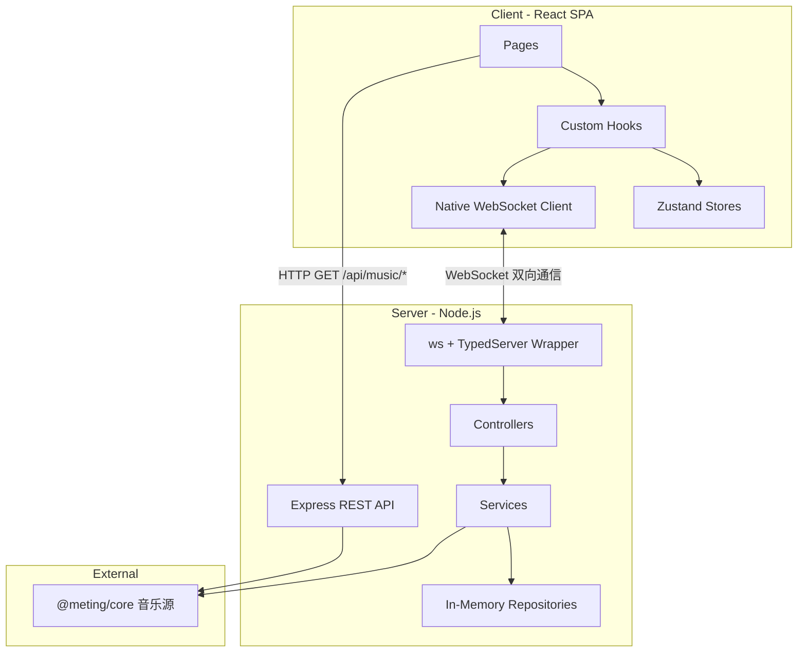

# 架构与数据流

## 整体架构



## Socket 事件清单

| 分类         | 客户端 → 服务端                                                                                                                     | 服务端 → 客户端                                                                                                                            |
| ------------ | ----------------------------------------------------------------------------------------------------------------------------------- | ------------------------------------------------------------------------------------------------------------------------------------------ |
| **Room**     | `room:create`, `room:join`, `room:leave`, `room:list`, `room:settings`, `room:set_role`                                             | `room:created`, `room:state`, `room:user_joined`, `room:user_left`, `room:settings`, `room:error`, `room:list_update`, `room:role_changed` |
| **Player**   | `player:play`, `player:pause`, `player:seek`, `player:next`, `player:prev`, `player:sync`, `player:sync_request`, `player:set_mode` | `player:play`, `player:pause`, `player:resume`, `player:seek`, `player:sync_response`                                                      |
| **Queue**    | `queue:add`, `queue:add_batch`, `queue:remove`, `queue:reorder`, `queue:clear`                                                      | `queue:updated`                                                                                                                            |
| **Chat**     | `chat:message`                                                                                                                      | `chat:message`, `chat:history`                                                                                                             |
| **Vote**     | `vote:start`, `vote:cast`                                                                                                           | `vote:started`, `vote:result`                                                                                                              |
| **Auth**     | `auth:request_qr`, `auth:check_qr`, `auth:set_cookie`, `auth:logout`, `auth:get_status`                                             | `auth:qr_generated`, `auth:qr_status`, `auth:set_cookie_result`, `auth:status_update`, `auth:my_status`                                    |
| **Playlist** | `playlist:get_my`                                                                                                                   | `playlist:my_list`                                                                                                                         |
| **NTP**      | `ntp:ping`                                                                                                                          | `ntp:pong`                                                                                                                                 |
| **Server**   | —                                                                                                                                   | `server:audio_proxy_policy`                                                                                                                |

## 关键数据模型

```typescript
// 音乐曲目
interface Track {
  id: string
  title: string
  artist: string[]
  album: string
  duration: number
  cover: string
  source: 'netease' | 'tencent' | 'kugou'
  sourceId: string
  urlId: string
  lyricId?: string
  picId?: string
  streamUrl?: string
  requiresServerProxy?: boolean // 上游字节需要服务器解密等处理
  requestedBy?: string // 点歌人昵称
  vip?: boolean // 是否为 VIP / 付费歌曲（可能无法播放或仅试听）
}

// 播放模式
type PlayMode = 'sequential' | 'loop-all' | 'loop-one' | 'shuffle'

// 音频质量档位 (kbps)
type AudioQuality = 128 | 192 | 320 | 999 | 'highest' | ProviderSpecificQuality

interface AudioProxyPolicy {
  kugouForceProxy: boolean
}

// 客户端可见的房间状态
interface RoomState {
  id: string
  name: string
  creatorId: string
  hostId: string
  hasPassword: boolean
  password?: string | null // 仅 owner 专用状态携带；公开状态不含该字段
  audioQuality: AudioQuality
  users: User[]
  queue: Track[]
  currentTrack: Track | null
  playState: PlayState
  playMode: PlayMode
}

// 播放状态（含服务端时间戳用于同步校准）
interface PlayState {
  isPlaying: boolean
  currentTime: number
  serverTimestamp: number
  revision?: number // 单调递增的播放动作代次；可选以兼容旧原生客户端和旧持久化数据
}

// 预定执行播放状态（play/pause/seek/resume 广播时使用）
interface ScheduledPlayState extends PlayState {
  serverTimeToExecute: number // 客户端应在此服务器时间点执行动作
}

// 歌单元数据
interface Playlist {
  id: string
  name: string
  cover: string
  trackCount: number
  source: MusicSource
  creator?: string
  description?: string
}

// 用户（RBAC: owner > admin > member）
// hostId 是自动选举的播放主持(conductor)，不是可见角色
interface User {
  id: string
  nickname: string
  role: UserRole
  client?: ClientInfo
  clients?: ClientInfo[]
}
type UserRole = 'owner' | 'admin' | 'member'

// 聊天消息
interface ChatMessage {
  id: string
  userId: string
  nickname: string
  content: string
  timestamp: number
  type: 'user' | 'system'
}
```

`User.client` 是为旧客户端保留的最近连接端标签，`User.clients` 是同一账号当前所有 WebSocket 连接的可选粗粒度设备列表。服务端根据握手中的 User-Agent 和浏览器客户端提示推断浏览器、操作系统或原生客户端类型，只广播类似 `Chrome · Windows`、`Safari · iPhone`、`Android 客户端` 的标签，不广播原始 User-Agent 或版本号；相同标签会通过可选 `count` 聚合。旧版 Web、Android 和 Windows 客户端可安全忽略新增字段并继续读取 `client`。

## 播放同步机制

采用**事件驱动同步 + 周期性比例漂移校正**架构：NTP 时钟同步 + Scheduled Execution + 比例控制漂移校正（EMA 平滑 + proportional rate + hard seek）。

**三层防护**：

1. **NTP 时钟同步**：保证各客户端时钟与服务器对齐（时间衰减加权中位数）
2. **Scheduled Execution**：离散事件（play/pause/seek/resume）通过预定执行消除网络延迟差异（P90 RTT 自适应调度）
3. **周期性比例漂移校正**：所有正在播放的客户端按用户配置的基础间隔发起 `PLAYER_SYNC_REQUEST`；连续稳定后自动放慢请求，出现漂移或从后台恢复时重新加速

## Layer 1：NTP 时钟同步 + RTT 回报

客户端与服务器通过 `ntp:ping` / `ntp:pong` 事件交换时间戳，计算 `clockOffset`（客户端与服务端时钟差值），使 `getServerTime()` 返回与服务端对齐的时间。

- 初始阶段：快速采样（每 50ms）收集 20 个样本，使用 `switchedRef` 保证仅在首次校准完成时切换到稳定阶段
- 稳定阶段：每 5 秒一次 NTP 心跳
- NTP 仅在用户进入房间后启动（`ClockSyncRunner` 渲染在 `RoomPage` 中），大厅用户不运行时钟同步
- 使用**时间衰减加权中位数**计算 offset：每个样本按 `exp(-age / halfLife)` 衰减（halfLife=30s），兼具中位数的异常值鲁棒性和对网络环境突变的快速收敛能力
- **`performance.now()` 锚点**：`getServerTime()` 基于 `performance.now()`（单调递增）计算时间流逝，不受系统时钟突变影响（NTP 调整、手动改时间、休眠唤醒）。每次 `processPong` 刷新锚点：`anchorServerTime = Date.now() + medianOffset`、`anchorPerfNow = performance.now()`
- **RTT 回报**：每次 `ntp:ping` 附带 `lastRttMs`（客户端中位 RTT），服务端在 `NTP_PING` handler 中调用 `roomRepo.setSocketRTT()` 存储，用于自适应调度延迟计算
- 核心模块：`clockSync.ts`（采样引擎 + `getServerTime()` + `getMedianRTT()` + `computeWeightedMedian()`）、`useClockSync.ts`（React Hook，在 SocketProvider 中运行）

## Layer 2：Scheduled Execution（预定执行）

所有多客户端同步动作（play、pause、seek、resume）由服务端广播 `ScheduledPlayState`，包含 `serverTimeToExecute` 字段。客户端收到后通过 `setTimeout(execute, serverTimeToExecute - getServerTime())` 在同一时刻执行，消除网络延迟差异。

- 服务端根据房间 **P90 RTT** 动态计算调度延迟：`max(P90RTT * 1.5 + 100, 300ms)`，上限 3000ms。P90 避免单个慢连接拖累整个房间，房间人数 ≤3 时退化为取 max
- RTT 由客户端 NTP 测量后通过 `ntp:ping` 事件回报，服务端以指数移动平均（alpha=0.2）平滑存储在 `roomRepository` 的 per-socket RTT map
- 全部客户端（含操作发起者）统一收到广播并在预定时刻执行
- **serverTimestamp 对齐**：播放中的动作（play/resume/seek）将 `room.playState.serverTimestamp` 设为 `serverTimeToExecute` 而非 `Date.now()`，此后服务端可独立估算权威进度
- Scheduled action（seek/pause/resume）执行时自动重置 `rate(1)`，避免残留非正常速率；执行后同步更新 `roomStore.playState`（仅 `PlayState` 三字段，不含 `serverTimeToExecute`），确保 recovery effect 读到最新状态
- **NTP 未校准保护**：`scheduleDelay()` 和 `usePlayer` 的 PLAYER_PLAY 调度在 NTP 未校准完成前退化为 0（立即执行），避免本地时钟偏差导致离谱的调度延迟
- **Action ID 竞态保护**：每个 scheduled action 分配单调递增 ID，`setTimeout(fn, 0)` 回调执行前检查 ID 是否匹配，防止快速连续事件导致 stale 回调执行
- **播放代次保护**：服务端在 play/pause/resume/seek/stop 时递增 `revision`；Web 客户端拒绝低于房间当前代次的迟到事件，并按“曲目 ID + 代次”实现断线恢复幂等。字段保持可选，旧 Android/Windows 客户端可继续忽略。

## Layer 3：周期性比例漂移校正（EMA + Proportional Rate + Hard Seek）

所有客户端（包括 `hostId` 对应用户）都跟随服务端权威时间轴。服务端通过 `estimateCurrentTimeAt()` 根据最近一次服务端动作的 `currentTime + serverTimestamp` 计算预期位置，并在 `PLAYER_SYNC_RESPONSE` 中附带可选 `trackId`；Web 客户端会丢弃上一首歌曲迟到的响应，Android/Windows 旧版本可安全忽略新字段。

- **接收延迟补偿**：客户端使用 NTP 服务器时间把响应传输耗时补回预期位置，并限制最大补偿量
- **EMA 平滑**：`smoothed = alpha * rawDrift + (1 - alpha) * previous`，pause/resume/切歌/hard seek 后由首个样本重新播种
- `|smoothedDrift|` 超过 `max(500ms, RTT / 2 + 250ms)` 且连续两次确认 → hard seek，并恢复用户音量
- 播放中的 HTML5 Howl 通过底层媒体元素直接定位并同步 Howler 内部锚点，避免公共 `seek()` 的 pause → seek → play 周期在移动端重新引入延迟；暂停或媒体元素尚未就绪时安全回退到公共 API
- `|smoothedDrift|` 位于 5ms 与 hard-seek 阈值之间 → SoundTouch 进行最大 ±1% 的保音调 tempo 修正
- `|smoothedDrift|` < 5ms → tempo 恢复为 1；连续三个稳定样本后同步请求间隔放慢到基础间隔的 2.5 倍（上限 60 秒）
- 页面从后台恢复时立即请求两次近距离样本，并重新进入快速同步间隔
- 用户可在设置中配置基础同步包间隔；自适应逻辑不会删除或覆盖该设置

典型场景：手机息屏暂停后解锁、浏览器后台标签页节流、网络波动导致的累积偏移。

## 服务端权威状态维护

- 播放、暂停、恢复、跳转和切歌都先更新服务端 `playState`，客户端只执行带服务器时间戳的结果
- `syncService.estimateCurrentTimeAt()` 对未来调度时间取非负 elapsed，并把结果限制在当前曲目时长内
- 永久房间播放时每 5 秒持久化一次服务端估算快照，重启后不依赖某个客户端恢复进度
- 新用户加入和断线重连都从 `ROOM_STATE` 获取服务端快照；`usePlayer` 避免与实时 `PLAYER_PLAY` 重复加载
- 预定动作或音频加载迟到时，客户端按实际服务器时间补偿位置，不从歌曲开头重新播放
- `hostId` 仍用于兼容房间角色和主持标识，但不向服务端提供权威播放进度

## 播放模式

队列删除当前歌曲时，服务端会在删除前按原索引计算后继，避免删除后 `currentTrack` 在队列中失去索引而错误回到第一首；`sequential` 尾部停止，循环模式回绕，随机模式仅从剩余歌曲中选择。连续同方向切歌受防抖保护，立即反向切歌不被误拦截。

房间支持 4 种播放模式（`PlayMode`），由 `room.playMode` 字段控制，默认 `loop-all`：

| 模式         | 说明                                   |
| ------------ | -------------------------------------- |
| `sequential` | 顺序播放，末尾停止                     |
| `loop-all`   | 列表循环，末尾回到第一首               |
| `loop-one`   | 单曲循环，重播当前曲目                 |
| `shuffle`    | 随机播放，从队列随机选一首（排除当前） |

- **Owner/Admin** 直接 emit `player:set_mode`，服务端更新 `room.playMode` 并广播 `ROOM_STATE`
- **Member** 通过 `vote:start { action: 'set-mode', payload: { mode } }` 投票切换
- **指定播放**：播放列表工具栏提供 Play 按钮，Owner/Admin 直接 emit `player:play`；Member 通过 `vote:start { action: 'play-track', payload: { trackId, trackTitle } }` 投票播放
- **投票移除**：播放列表工具栏的删除按钮对所有用户可见，Owner/Admin 直接 emit `queue:remove`；Member 通过 `vote:start { action: 'remove-track', payload: { trackId, trackTitle } }` 投票移除
- 服务端 `queueService.getNextTrack(roomId, playMode)` 根据模式返回下一首；`getPreviousTrack` 在 `loop-all` 模式下支持尾→首回绕
- 客户端 `PlayerControls` 提供循环切换按钮，带 `AnimatePresence` 图标过渡动画

## 音频质量

房间音质由 `room.audioQuality` 字段控制，默认 `320`（HQ）。除固定和平台特色档位外，`highest` 表示“尽量高”：

| 档位    | bitrate  | 说明                                 |
| ------- | -------- | ------------------------------------ |
| 标准    | 128 kbps | 流量节省                             |
| 较高    | 192 kbps | 平衡音质与流量                       |
| HQ      | 320 kbps | 高品质（默认）                       |
| 无损 SQ | 999 kbps | 无损音质，通常需要 VIP 账号          |
| 尽量高  | highest  | 根据歌曲平台及房间内最高会员等级选择 |

- **房主和房间管理员**可在房间设置中切换音质；其他房间设置仍仅限房主
- 登录平台会员账号不会改变房间音质；新房间仍保持默认 `320`，需要房主手动切换其他档位
- 音质切换仅对**下一首歌**生效，当前播放不中断
- 服务端将各平台会员统一为 `0/1/2`（普通/VIP/SVIP），并从房间凭据池选择该歌曲平台等级最高的账号
- `audioQualityPolicy.getEffectiveQuality()` 一次确定不超过账号权益和房间设置的目标档位，不通过连续请求猜测会员等级
- 网易云：普通账号最高 320、VIP 最高高清臻音、SVIP 最高超清母带；QQ 与酷狗使用各自对应的 VIP/SVIP 档位
- B站：普通账号最高 192K，普通/年度大会员最高 Hi-Res；服务端用带 Cookie 的单次 WBI `playurl` 请求合并普通和 FLAC DASH 音轨，并在同一响应内选择不超过目标的最高可用档位。B站杜比为 E-AC-3，桌面浏览器支持不完整，当前明确不参与选流
- B站沿用现有五档，不增加平台专属 UI 选项：

| 房间音质       | 无会员   | 普通大会员 | 年度大会员 |
| -------------- | -------- | ---------- | ---------- |
| 标准 128kbps   | B站 132K | B站 132K   | B站 132K   |
| 较高 192kbps   | B站 192K | B站 192K   | B站 192K   |
| 高品质 320kbps | B站 192K | B站 192K   | B站 192K   |
| 无损 SQ        | B站 192K | Hi-Res     | Hi-Res     |
| 尽量高         | B站 192K | Hi-Res     | Hi-Res     |

B站没有与房间 128K、320K 完全对应的普通 DASH 音轨，因此分别映射为最接近的 132K、192K。Hi-Res 还要求视频本身提供 FLAC 音轨，否则直接从同一次响应选 192K，不再次请求其他音质。

- 上游若返回歌曲实际可用的较低规格，服务端记录 `actualQuality` 和实际平均码率，不再逐档重新请求
- `musicProvider.streamUrlCache` 的 key 包含 bitrate，不同音质自动隔离缓存

## 音频代理策略

- B站音频始终通过服务器代理，播放所需 Cookie 只保留在服务端，不提供关闭入口。
- 全局 `AudioProxyPolicy` 只包含酷狗策略并持久化在 SQLite `server_settings` 表，旧数据库或无效配置默认酷狗强制代理。
- 只有服务器管理员可以通过 `GET/PATCH /api/admin/audio-proxy-policy` 读取或修改酷狗策略；PATCH 接受 `kugouForceProxy` 并返回完整策略。
- 新 WebSocket 连接会收到 `server:audio_proxy_policy`，管理员修改后服务端向 `lobby` 中的全部连接广播完整策略。
- `kugouForceProxy=false` 时，Web 端的酷狗标准版明文资源由兼容代理入口返回 `307` 到 CDN，音频字节不经过服务器；酷狗概念版和需要服务端处理的资源仍使用代理。Android 继续按自身能力先请求 CDN，失败时仅回退一次现有服务器代理。
- 重新启用酷狗强制代理时，Android 将正在直连的对应曲目保留位置切回代理；关闭强制代理不打断当前播放，从下一次加载开始生效。
- 酷狗策略同时覆盖 `kugou` 与 `kugou_concept`。服务端登记概念版 URL，并为已注册 QMC2 解密器的流设置 `Track.requiresServerProxy=true`；`.mflac`/`.mgg` 地址也按加密资源保守处理。Android 即使在关闭强制代理时也直接使用服务器代理解密，仅对明文资源尝试 CDN 直连。

## 队列清空

- Owner/Admin 可通过播放列表抽屉的「清空」按钮（`ListX` 图标）一次性清空队列
- 采用二次确认防误操作：首次点击变为 destructive 提示，3 秒内再次点击才执行
- 服务端 `queue:clear` handler 复用 `remove` on `Queue` 权限，清空后停止播放并广播 `QUEUE_UPDATED` + `PLAYER_PAUSE` + `ROOM_STATE`

## 其他同步机制

1. **暂停快照**：服务端 `pauseTrack()` 在暂停前调用 `estimateCurrentTime()` 快照准确位置
2. **恢复播放**：暂停后点击播放，服务端检测同一首歌时发 `player:resume`（所有客户端预定时刻恢复）
3. **自动续播**：房主独自重新加入时，若有歌曲暂停/排队中，自动恢复播放
4. **加入房间补偿**：中途加入的客户端使用 `getServerTime()` 计算当前应处的播放位置，采用 fade-in 淡入策略（400ms 等待 + 200ms fade）减少加入延迟
5. **房间宽限期**：普通房间空置 60 秒 (`ROOM_GRACE_PERIOD_MS`) 后自动清理（重复调用 `scheduleDeletion` 不会创建重复 timer）；永久房间不会因空置被清理，最近 200 条聊天消息会持久化到 SQLite 并在服务重启后恢复
6. **角色与 Conductor 机制**：房间记录 `creatorId`（创建者 ID，永久不变）、`adminUserIds: Set<string>`（持久化 admin 集合）和 `temporaryAdminUserId`（临时管理员，仅在线态）。非空房间通过 `reconcileRoomRoles()` 保证至少有一个具备管理能力的在线用户：创建者在线时为 `owner`；持久 admin 在线时保持 `admin`；若 owner / 持久 admin 都不在线，则选择一个在线成员作为临时 `admin`，且不写入 `adminUserIds`。owner / 持久 admin 返回时会清除临时管理员并恢复其普通成员身份。`room.hostId` 是自动选举的播放主持（conductor），在用户加入/离开时基于已协调后的角色重选（优先级：owner > admin > member），无需宽限期。`setUserRole` 只能设置持久 `admin` / `member`（不能改 `owner`），同步维护 `adminUserIds`。返回的创建者/持久化 admin 免密码验证
7. **持久化用户身份**：客户端通过 `storage.getUserId()` 生成并持久化 `nanoid`，每次 `ROOM_CREATE` / `ROOM_JOIN` 携带 `userId`，使服务端可跨 socket 重连识别同一用户。服务端通过 `roomRepo.getSocketMapping(socket.id)` 获取 `{ roomId, userId }` 映射——`socket.id` 仅用于 Socket 映射查找，所有涉及用户身份的操作（host 判断、auth cookie 归属、权限检查等）统一使用 `mapping.userId`
8. **`currentUser` 自动推导**：`roomStore` 中 `currentUser` 始终从 `room.users` 自动推导（`deriveCurrentUser`），`setRoom` / `addUser` / `removeUser` / `updateRoom` 等 action 内部自动同步，不暴露 `setCurrentUser` 以避免脱节风险
9. **断线时钟重置**：`resetAllRoomState()` 除重置 Zustand stores 外，还调用 `resetClockSync()` 清空 NTP 采样，确保重连后使用全新的时钟校准数据
10. **Socket 断开竞态防护**：页面刷新时新旧 socket 的 join/disconnect 到达顺序不确定，`leaveRoom` 通过 `roomRepo.hasOtherSocketForUser()` 检测同一用户是否有更新的 socket 连接，避免旧 socket disconnect 误删活跃用户
11. **投票安全网**：`voteController` 接收 `VOTE_START` 时，若检测到用户已有直接操作权限（owner/admin），不再返回错误，而是直接执行该操作，防止客户端-服务端角色不同步时操作失效。部分 VoteAction 通过 `PERM_MAP` 映射到不同的 CASL action+subject（如 `'play-track'` → `('play', 'Player')`，`'remove-track'` → `('remove', 'Queue')`）
12. **切歌防抖**：500ms (`PLAYER_NEXT_DEBOUNCE_MS`) 内不重复触发同方向切歌，但允许立即反向操作。`playNextTrackInRoom` / `playPrevTrackInRoom` 将 debounce 检查和队列导航封装在 per-room mutex 内部，确保同 tick 的多个事件不会同时通过。投票执行、删除当前曲目等场景可使用 `{ skipDebounce: true }`
13. **停止播放统一处理**：`playerService.stopPlayback()` 统一处理"队列为空/清空"场景——清除 currentTrack、emit PLAYER_PAUSE、广播 ROOM_STATE、刷新大厅列表，避免 controller 中重复逻辑。`stopPlaybackSafe()` 提供 mutex 保护版本，`QUEUE_CLEAR` 使用此版本防止与并发 `autoPlayIfEmpty` 竞态
14. **大厅重连刷新**：`useLobby` 监听 socket `connect` 事件，断线重连后自动重新拉取房间列表
15. **投票执行**：决定产生后先按 vote ID 原子领取并移出活动表，再 `await` 执行动作，避免多个决定票或旧超时回调重复执行/取消新投票。成员加入、离开或主持人变化时会重算多数门槛、清理离线票并更新否决权；动作完成后才广播 `VOTE_RESULT`
16. **密码安全隔离**：`toPublicRoomState()` 默认不含密码明文；`toPublicRoomStateForOwner()` 仅在发送给 owner 的 socket 时使用（创建房间、加入房间、设置变更、conductor/角色变更）。非 owner 成员仅能看到 `hasPassword` 布尔标记，无法获取密码明文。设置广播通过 `socket.emit`（owner） + `socket.to(roomId).emit`（其他成员）分别发送。owner 在线且 conductor/角色变更时，通过 `roomRepo.getSocketIdForUser()` 反查 owner 的 socketId 定向发送含密码版本；没有 owner 在线（仅临时管理员）时广播不含密码版本

## REST API

| 路径                            | 方法  | 用途                                                                                                    |
| ------------------------------- | ----- | ------------------------------------------------------------------------------------------------------- |
| `/api/music/search`             | GET   | 搜索曲目（`source` + `keyword` + `page`）                                                               |
| `/api/music/url`                | GET   | 解析流媒体 URL（`source` + `id`）                                                                       |
| `/api/music/lyric`              | GET   | 获取歌词                                                                                                |
| `/api/music/cover`              | GET   | 获取封面图                                                                                              |
| `/api/music/cover-proxy`        | GET   | 代理受信音乐 CDN 封面；逐跳校验 HTTPS 重定向、图片类型和 10 MiB 上限                                    |
| `/api/music/playlist`           | GET   | 获取歌单曲目列表（`source` + `id` + `limit` + `offset`），分页返回 `{ tracks, total, offset, hasMore }` |
| `/api/rooms/:roomId/check`      | GET   | 房间预检（存在性 + 是否需要密码），用于分享链接直接访问时的前置校验                                     |
| `/api/admin/audio-proxy-policy` | GET   | 服务器管理员读取酷狗全局强制代理策略                                                                    |
| `/api/admin/audio-proxy-policy` | PATCH | 服务器管理员部分更新代理策略并广播完整结果                                                              |
| `/api/health`                   | GET   | 健康检查                                                                                                |

---
